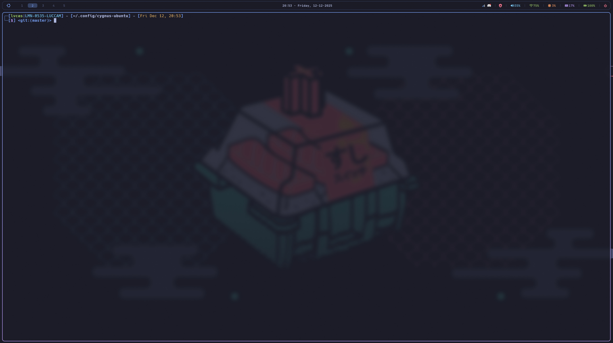

# Cygnus-Ubuntu



A curated Hyprland desktop environment for Ubuntu 24.04, combining the best configurations and scripts from multiple sources into a cohesive, opinionated setup.


## Overview

Cygnus-Ubuntu is a personal dotfiles collection that merges configurations from several excellent Hyprland/Linux customization projects. It's designed for a fast, keyboard-driven workflow with a cohesive Tokyo Night-inspired aesthetic.

## Sources & Credits

This project is built upon the work of these amazing projects:

| Project | Author | Description |
|---------|--------|-------------|
| [Ubuntu-Hyprland](https://github.com/JaKooLit/Ubuntu-Hyprland) | JaKooLit | Hyprland installation scripts and dotfiles for Ubuntu |
| [Omakub](https://github.com/basecamp/omakub) | Basecamp (DHH) | Opinionated Ubuntu setup for web developers |
| [Omarchy](https://github.com/basecamp/omarchy) | Basecamp (DHH) | Arch Linux variant of Omakub with Hyprland |
| [asus-linux](https://gitlab.com/asus-linux) | Luke Jones | ASUS laptop Linux support (asusctl, supergfxctl) |

## What's Included

### Window Manager & Desktop
- **Hyprland** - Tiling Wayland compositor
- **Waybar** - Customizable status bar (Tokyo Night themed)
- **Rofi** - Application launcher and menus (25+ themed configs)
- **SwayNC** - Notification center
- **Hyprlock** - Screen locker (Tokyo Night themed)
- **Hypridle** - Idle daemon
- **swww** - Wallpaper daemon with effects
- **wlogout** - Power menu

### Terminal & Shell
- **WezTerm** - GPU-accelerated terminal
- **Kitty** - Alternative terminal
- **Zsh** - Shell with Oh-My-Zsh
- **Starship** - Cross-shell prompt

### Development
- **Neovim** - With LazyVim configuration
- **lazygit** - Terminal UI for git
- **mise** - Polyglot runtime manager

### Theming
- **Flat-Remix GTK** - GTK theme (Blue Dark)
- **Flat-Remix Icons** - Icon theme
- **Bibata Cursors** - Modern cursor theme
- **Kvantum** - Qt theme engine
- **qt5ct/qt6ct** - Qt configuration
- **Wallust** - Colorscheme generation

### Utilities
- **btop** - System monitor
- **cava** - Audio visualizer
- **fastfetch** - System info display
- **swappy** - Screenshot annotation
- **cliphist** - Clipboard manager
- **hyprpicker** - Color picker
- **playerctl** - Media controls

### ASUS Laptop Support
- **asusctl** - ASUS laptop control
- **supergfxctl** - GPU switching
- **rogauracore** - Keyboard RGB control

## Installation

### Prerequisites

- Ubuntu 24.04 (Noble Numbat) fresh install recommended
- Internet connection
- sudo privileges

### Quick Install

```bash
# Clone the repository
git clone https://github.com/LvcasX1/cygnus-ubuntu.git ~/.config/cygnus-ubuntu

# Run the installer
cd ~/.config/cygnus-ubuntu
./install.sh
```

### Installation Options

The installer provides a menu with the following options:

| Option | Description |
|--------|-------------|
| **1** | Install Everything (Full Setup) |
| **2** | Base System Packages |
| **3** | Hyprland + Wayland Ecosystem |
| **4** | Shell (Zsh + Oh-my-zsh + plugins) |
| **5** | Neovim + LazyVim |
| **6** | ASUS Tools (asusctl, rogauracore) |
| **7** | NVIDIA Drivers |
| **8** | Applications |
| **9** | Claude Code CLI |
| **T** | GTK/Icon/Cursor Themes |
| **S** | Setup Symlinks Only |
| **W** | Setup Wallpapers |
| **D** | Restore dconf Settings |

### Symlinks Only

If you already have dependencies installed and just want the dotfiles:

```bash
./setup-symlinks.sh
```

This will:
1. Backup existing configs to `~/.config/cygnus-ubuntu-backups/`
2. Create symlinks from the dotfiles to their expected locations

## Directory Structure

```
cygnus-ubuntu/
├── dotfiles/               # Configuration files
│   ├── btop/               # System monitor config
│   ├── cava/               # Audio visualizer config
│   ├── fastfetch/          # System info config
│   ├── dconf/              # GNOME/GTK settings backup
│   ├── gtk-3.0/            # GTK3 settings
│   ├── hypr/               # Hyprland configuration
│   │   ├── cygnus-ubuntu/  # Main Cygnus-Ubuntu config
│   │   │   ├── hyprland-cygnus-ubuntu.conf
│   │   │   ├── bindings.conf
│   │   │   └── looknfeel.conf
│   │   ├── configs/        # Base HyDE configs
│   │   ├── scripts/        # Hyprland scripts (70+)
│   │   │   ├── gdm_wallpaper.sh
│   │   │   ├── gdm_tokyonight_theme.sh
│   │   │   └── ...
│   │   ├── UserConfigs/    # User customizations
│   │   ├── UserScripts/    # User scripts
│   │   ├── hyprlock.conf   # Lock screen config
│   │   ├── hyprlock-1080p.conf
│   │   └── hypridle.conf   # Idle daemon config
│   ├── kitty/              # Kitty terminal config
│   ├── Kvantum/            # Qt theme engine
│   ├── nvim/               # Neovim/LazyVim config
│   ├── qt5ct/              # Qt5 configuration
│   ├── rofi/               # Launcher themes (25+ configs)
│   ├── sddm/               # SDDM theme config
│   ├── swaync/             # Notification center
│   ├── wallust/            # Colorscheme generator
│   ├── waybar/             # Status bar config
│   ├── wezterm/            # Terminal config
│   └── zshrc               # Shell configuration
├── scripts/                # Installation scripts
│   ├── install-apps.sh
│   ├── install-asus.sh
│   ├── install-base.sh
│   ├── install-claude.sh
│   ├── install-hyprland.sh
│   ├── install-nvidia.sh
│   ├── install-nvim.sh
│   ├── install-shell.sh
│   ├── install-themes.sh
│   └── restore-dconf.sh
├── test/                   # Testing tools
│   ├── Dockerfile
│   └── docker-test.sh
├── wallpapers/             # Default wallpapers (Tokyo Night)
├── current/                # Current state (wallpaper, etc.)
├── install.sh              # Main installer
├── setup-symlinks.sh       # Symlink setup script
├── validate.sh             # Configuration validator
└── README.md               # This file
```

## Keybindings

Default modifier key: `SUPER` (Windows key)

### Window Management
| Keybinding | Action |
|------------|--------|
| `SUPER + W` | Close window |
| `SUPER + T` | Toggle floating/tiling |
| `SUPER + F` | Fullscreen |
| `SUPER + CTRL + F` | Maximize (keep bar visible) |
| `SUPER + A` | Toggle split direction |
| `SUPER + O` | Pop window out |
| `SUPER + SHIFT + Q` | Exit Hyprland |

### Focus & Navigation
| Keybinding | Action |
|------------|--------|
| `SUPER + H/J/K/L` | Focus left/down/up/right (vim-style) |
| `SUPER + Arrow keys` | Focus left/down/up/right |
| `ALT + Tab` | Cycle windows |

### Resize & Move Windows
| Keybinding | Action |
|------------|--------|
| `SUPER + SHIFT + H/J/K/L` | Resize window |
| `SUPER + CTRL + H/J/K/L` | Move window |
| `SUPER + ALT + H/J/K/L` | Swap window |
| `SUPER + Mouse drag` | Move/resize window |

### Workspaces
| Keybinding | Action |
|------------|--------|
| `SUPER + 1-0` | Switch to workspace 1-10 |
| `SUPER + SHIFT + 1-0` | Move window to workspace |
| `SUPER + SHIFT + ALT + 1-0` | Move window silently |
| `SUPER + Tab` | Next workspace |
| `SUPER + SHIFT + Tab` | Previous workspace |
| `SUPER + S` | Toggle scratchpad |

### Applications
| Keybinding | Action |
|------------|--------|
| `SUPER + Return` | Terminal (WezTerm) |
| `SUPER + D` | App launcher (rofi) |
| `SUPER + E` | File manager |
| `SUPER + B` | Browser |
| `SUPER + Space` | Cygnus-Ubuntu menu |
| `CTRL + ALT + L` | Lock screen |
| `CTRL + ALT + P` | Power menu |

### Screenshots
| Keybinding | Action |
|------------|--------|
| `Print` | Full screenshot |
| `SUPER + Print` | Area screenshot |
| `ALT + Print` | Active window |
| `SUPER + SHIFT + Print` | Screenshot + edit (swappy) |
| `SUPER + SHIFT + C` | Color picker |

### Utilities
| Keybinding | Action |
|------------|--------|
| `SUPER + /` | Keybinds help |
| `SUPER + ALT + E` | Emoji picker |
| `SUPER + ALT + C` | Calculator |
| `SUPER + CTRL + V` | Clipboard manager |
| `SUPER + W` | Wallpaper selector |
| `SUPER + SHIFT + W` | Wallpaper effects |
| `SUPER + CTRL + B` | Waybar styles menu |
| `SUPER + N` | Toggle nightlight |
| `SUPER + ALT + L` | Toggle master/dwindle layout |
| `SUPER + SHIFT + G` | Toggle game mode |

### Media Controls
| Keybinding | Action |
|------------|--------|
| `XF86Audio*` | Volume controls |
| `XF86MonBrightness*` | Screen brightness |
| `XF86KbdBrightness*` | Keyboard backlight |
| `XF86AudioPlay/Next/Prev` | Media playback |

See `~/.config/hypr/cygnus-ubuntu/bindings.conf` and `~/.config/hypr/UserConfigs/UserKeybinds.conf` for the complete list.

## Customization

### User Configurations

Personal customizations should go in:
- `~/.config/hypr/UserConfigs/` - Hyprland user configs
- `~/.config/hypr/UserScripts/` - Custom scripts
- `~/.config/hypr/cygnus-ubuntu/` - Main Cygnus-Ubuntu configs

Key configuration files:
- `bindings.conf` - Keyboard shortcuts
- `looknfeel.conf` - Colors, gaps, animations
- `hyprland-cygnus-ubuntu.conf` - Main entry point

### Wallpapers

Place wallpapers in `~/Pictures/wallpapers/`. Use the wallpaper tools:

| Keybinding | Action |
|------------|--------|
| `SUPER + W` | Wallpaper selector |
| `SUPER + SHIFT + W` | Wallpaper effects |
| `CTRL + ALT + W` | Random wallpaper |

### Theme

The default theme is Tokyo Night. Colors are managed through:
- Kvantum for Qt applications
- GTK themes for GTK applications
- Wallust for dynamic colorscheme generation

## Login Screen Theming

### GDM (GNOME Display Manager)

Cygnus-Ubuntu includes scripts to theme the GDM login screen with Tokyo Night colors.

#### GDM Wallpaper
```bash
# Set custom login wallpaper
sudo ~/.config/hypr/scripts/gdm_wallpaper.sh
```

This copies the Tokyo Night wallpaper to `/usr/share/backgrounds/cygnus-ubuntu/login.png` and updates the GDM CSS.

#### GDM Tokyo Night Theme
```bash
# Apply full Tokyo Night theme to GDM
sudo ~/.config/hypr/scripts/gdm_tokyonight_theme.sh
```

This script:
- Extracts and recompiles the GDM gresource (GNOME Shell Theme)
- Applies Tokyo Night colors to login dialog, input fields, buttons, and user list
- Creates a backup of the original gresource (`.orig`)

**Dependencies:** `libglib2.0-dev-bin` (for `glib-compile-resources`)

### Hyprlock (Screen Lock)

Hyprlock is configured with Tokyo Night aesthetics:
- **Background:** Blurred wallpaper (5px blur, 3 passes)
- **Clock:** Large blue time display (#7aa2f7)
- **Date:** Lavender date text (#c0caf5)
- **Input field:** Tokyo Night styled password entry with caps lock detection

Configuration files:
- `~/.config/hypr/hyprlock.conf` - High DPI version
- `~/.config/hypr/hyprlock-1080p.conf` - 1080p optimized version

### SDDM (Alternative)

If using SDDM instead of GDM, a Tokyo Night theme config is available:
- `~/.config/sddm/theme.conf.tokyonight`

### Tokyo Night Color Palette

| Color | Hex | Usage |
|-------|-----|-------|
| Background | `#1a1b26` | Dark navy base |
| Foreground | `#c0caf5` | Light lavender text |
| Blue | `#7aa2f7` | Primary accent |
| Purple | `#bb9af7` | Secondary accent |
| Cyan | `#7dcfff` | Highlights |
| Green | `#9ece6a` | Success states |
| Red | `#f7768e` | Errors |
| Comment | `#565f89` | Muted text |

## Troubleshooting

### Hyprland won't start
```bash
# Check for errors
Hyprland -c ~/.config/hypr/hyprland.conf
```

### Waybar not showing
```bash
# Restart waybar
pkill waybar && waybar &
```

### GDM theme not applying
```bash
# Ensure glib-compile-resources is installed
sudo apt install libglib2.0-dev-bin

# Re-run the theme script
sudo ~/.config/hypr/scripts/gdm_tokyonight_theme.sh

# Restart GDM
sudo systemctl restart gdm
```

### Hyprlock not working
```bash
# Test hyprlock manually
hyprlock

# Check config syntax
hyprland -c ~/.config/hypr/hyprlock.conf --check
```

### Reset to defaults
```bash
# Re-run symlink setup (backups are created automatically)
./setup-symlinks.sh

# Validate configuration
./validate.sh
```

## Contributing

This is a personal configuration, but feel free to fork and adapt it to your needs.

## License

MIT License - See individual project licenses for components from other sources.

## Acknowledgments

Special thanks to:
- **JaKooLit** for the incredible Ubuntu-Hyprland scripts and dotfiles
- **DHH and Basecamp** for Omakub and Omarchy inspiration
- **Luke Jones** for asus-linux tools
- The **Hyprland** community for the amazing compositor
- All the developers of the tools and applications included in this setup
